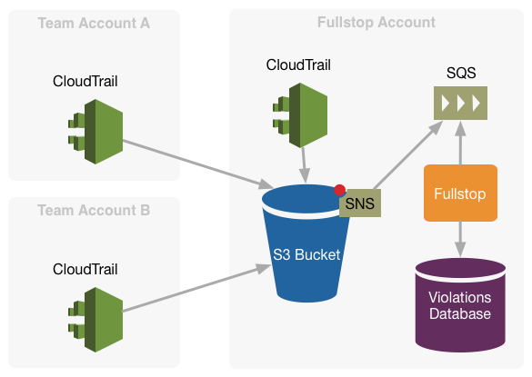
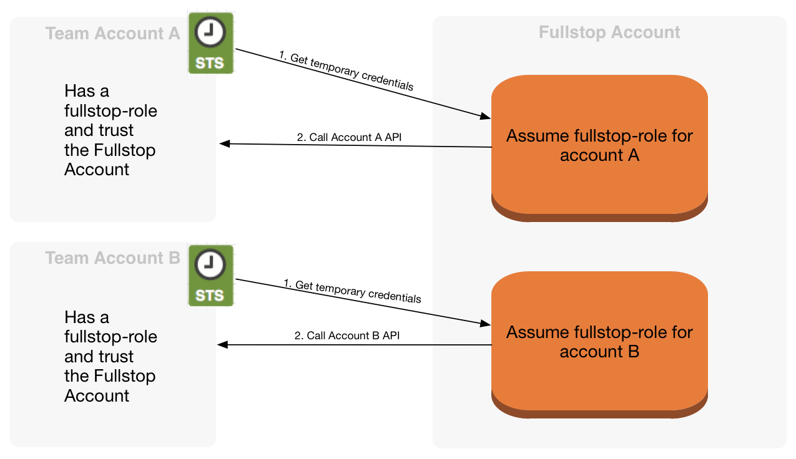

<!---

--->
#Fullstop - Audit reporting

Aim of the project is to enrich CloudTrail log events.

In our scenario we have multiple AWS accounts that need to be handled.

Each of this account has CloudTrail activated and is configured to write
in a bucket that resides in the account where also fullstop is running.
(Right now in AWS it's not possible to read CloudTrail logs from a different account)

Fullstop will then process events collected from CloudTrail.

To enrich CloudTrail log events with information that comes
from other systems than AWS, we should only configure fullstop to do so.

Fullstop can even call the AWS API of a different account, by using a [cross-account role](http://docs.aws.amazon.com/IAM/latest/UserGuide/roles-walkthrough-crossacct.html).
The account that is running fullstop should therefore be trusted
by all other accounts in order to perform this operations.

##Configuration

This enviroment variable should be set:

    FULLSTOP_SQS_URL
    FULLSTOP_SQS_REGION
    FULLSTOP_S3_REGION
    FULLSTOP_WHITELISTED_AMI_ACCOUNT
    FULLSTOP_S3_BUCKET

Example:

    $ export FULLSTOP_SQS_URL=https://sqs.eu-central-1.amazonaws.com/ACCOUNT_ID/fullstop
    $ export FULLSTOP_SQS_REGION=eu-central-1
    $ export FULLSTOP_S3_REGION=eu-west-1
    $ export FULLSTOP_WHITELISTED_AMI_ACCOUNT=999999999999
    $ export FULLSTOP_S3_BUCKET=fullstop-bucket

##How to build

    $ mvn clean install

##How to run

    $ cd fullstop

    $ mvn spring-boot:run

## License

Copyright © 2015 Zalando SE

Licensed under the Apache License, Version 2.0 (the "License");
you may not use this file except in compliance with the License.
You may obtain a copy of the License at

   [http://www.apache.org/licenses/LICENSE-2.0](http://www.apache.org/licenses/LICENSE-2.0)

Unless required by applicable law or agreed to in writing, software
distributed under the License is distributed on an "AS IS" BASIS,
WITHOUT WARRANTIES OR CONDITIONS OF ANY KIND, either express or implied.
See the License for the specific language governing permissions and
limitations under the License.
