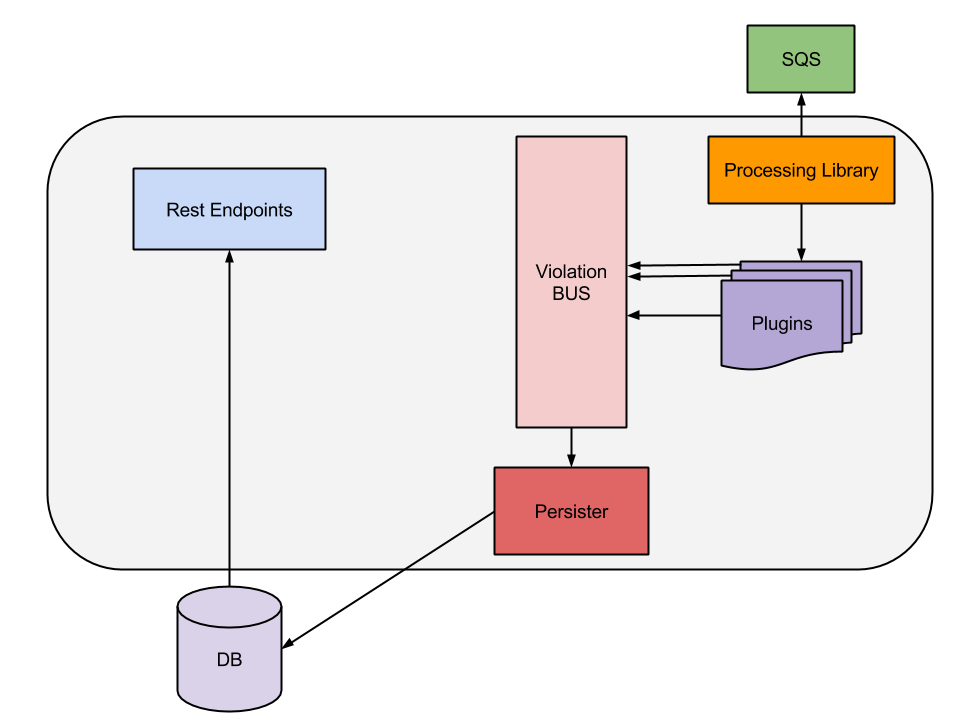

[](http://docs.stups.io/en/latest/components/fullstop.html)
[](https://travis-ci.org/zalando-stups/fullstop)
[](https://coveralls.io/r/zalando-stups/fullstop)
[](http://editor.swagger.io/#/?import=https://raw.githubusercontent.com/zalando-stups/fullstop/master/fullstop-api.yaml#/)
[](http://www.apache.org/licenses/LICENSE-2.0)


[](https://gitter.im/zalando-stups/fullstop?utm_source=badge&utm_medium=badge&utm_campaign=pr-badge&utm_content=badge)


#Fullstop - Audit reporting

###Fullstop AWS overview

###Fullstop Architecture overview


Aim of the project is to enrich CloudTrail log events.

In our scenario we have multiple AWS accounts that need to be handled.

Each of this account has CloudTrail activated and is configured to write
in a bucket that resides in the account where also fullstop is running.
(Right now in AWS it's not possible to read CloudTrail logs from a different account)

Fullstop will then process events collected from CloudTrail.

To enrich CloudTrail log events with information that comes
from other systems than AWS, we should only configure fullstop to do so.

Fullstop can even call the AWS API of a different account, by using a [cross-account role](http://docs.aws.amazon.com/IAM/latest/UserGuide/roles-walkthrough-crossacct.html).
The account that is running fullstop should therefore be trusted
by all other accounts in order to perform this operations.


##Plugins

* [fullstop-hello-event-plugin](fullstop-plugins/fullstop-hello-event-plugin)
* [fullstop-ami-plugin](fullstop-plugins/fullstop-ami-plugin)
* [fullstop-instance-plugin](fullstop-plugins/fullstop-instance-plugin)
* [fullstop-keypair-plugin](fullstop-plugins/fullstop-keypair-plugin)
* [fullstop-region-plugin](fullstop-plugins/fullstop-region-plugin)
* [fullstop-registry-plugin](fullstop-plugins/fullstop-registry-plugin)
* [fullstop-subnet-plugin](fullstop-plugins/fullstop-subnet-plugin)

##Configuration

This enviroment variable should be set:

    FULLSTOP_LOGS
    FULLSTOP_SQS_URL
    FULLSTOP_SQS_REGION
    FULLSTOP_S3_REGION
    FULLSTOP_WHITELISTED_AMI_ACCOUNT
    FULLSTOP_AMI_NAME_START_WITH
    FULLSTOP_S3_BUCKET
    FULLSTOP_KIO_URL
    FULLSTOP_PIERONE_URL
    DATABASE_URL
    DATABASE_USER
    DATABASE_PASSWORD
    DATABASE_DRIVER
    AMAZON_KEY_ID
    ENCRYPT_REGION
    INSTANCE_LOGS_S3_BUCKET
    ACCESS_TOKEN_URI
    CREDENTIALS_DIR
    TOKEN_INFO_URI

Example:

    $ export FULLSTOP_LOGS=/fullstop_logs_dir
    $ export FULLSTOP_SQS_URL=https://sqs.eu-central-1.amazonaws.com/ACCOUNT_ID/fullstop
    $ export FULLSTOP_SQS_REGION=eu-central-1
    $ export FULLSTOP_S3_REGION=eu-west-1
    $ export FULLSTOP_WHITELISTED_AMI_ACCOUNT=999999999999
    $ export FULLSTOP_AMI_NAME_START_WITH=Taupage
    $ export FULLSTOP_S3_BUCKET=fullstop-bucket
    $ export FULLSTOP_KIO_URL: https://application.registry.address
    $ export FULLSTOP_PIERONE_URL: https://docker.repository.address
    $ export DATABASE_URL='jdbc:postgresql://localhost:5432/fullstop'
    $ export DATABASE_USER=postgres
    $ export DATABASE_PASSWORD='{cipher}234laksnfdlF83NHALF'
    $ export DATABASE_DRIVER=org.postgresql.Driver
    $ export AMAZON_KEY_ID=arn:aws:kms:eu-west-1:089972051332:key/9d9fca31-54c5-4df5-ba4f-127dfb9a5031
    $ export ENCRYPT_REGION=eu-west-1
    $ export INSTANCE_LOGS_S3_BUCKET=my-s3-bucket
    $ export ACCESS_TOKEN_URI=accessTokenUri
    $ export CREDENTIALS_DIR=/location/credentials
    $ export TOKEN_INFO_URI=tokenInfoUri

##Database setup
Fullstop will store the violations in a RDBMS. Once you start Fullstop, it will create the necessary schema and tables
for you. The database itself, however, has to be created by you.
Your database password is encrypted with [AWS KMS](https://docs.aws.amazon.com/kms/latest/developerguide/overview.html). 
We are using our [Spring Cloud Config add-on](https://github.com/zalando/spring-cloud-config-aws-kms) to decrypt the
the password on the fly. 
To use Amazons KMS for de/encryption, you need to to provide a region and the key id for your key. In Fullstop, both
will be provided via environment variables.

The password should be already encrypted, when you store it in the ```DATABASE_PASSWORD``` environment variable. An 
encrypted password always starts with ```{cipher}```. You can use our [CLI tool](https://github.com/zalando/spring-cloud-config-aws-kms/tree/master/encryption-cli)
for encryption or you use Amazons [AWS CLI](http://docs.aws.amazon.com/cli/latest/reference/kms/encrypt.html#examples). 

##Propose API changes

**Important** all changes should be swagger 2.0 spec copliant. 

* Click here [](http://editor.swagger.io/#/?import=https://raw.githubusercontent.com/zalando-stups/fullstop/master/fullstop-api.yaml#/) to edit the API definition.
* Copy your changes and paste it in the [Github web editor: fullstop-api.yaml](https://github.com/zalando-stups/fullstop/edit/master/fullstop-api.yaml).
* Create a pull request with the new swagger 2.0 spec.

##How to build

    $ mvn clean install

##How to run

    $ cd fullstop

    $ mvn spring-boot:run
    
##How to build a docker image

Build fullstop:

    $ mvn clean install -U
    
Build scm-source.json:

    $ ./scm-source.sh
    
Build docker image:

    $ docker build -t registry/fullstop:0.1 fullstop

Show images:

    $ docker images

Run with docker:

    $ docker run -it registry/fullstop:0.1

Push docker image:

    $ docker push registry/fullstop:0.1
    
##How to deploy

    $ mvn release:prepare
    
    $ mvn release:perform

## Project TODO:
- [x] Oauth 2.0 spring configuration
- [x] Implement API for FE
- [x] Auditing on entity
- [ ] Pageable
- [ ] ...

## License

Copyright © 2015 Zalando SE

Licensed under the Apache License, Version 2.0 (the "License");
you may not use this file except in compliance with the License.
You may obtain a copy of the License at

   [http://www.apache.org/licenses/LICENSE-2.0](http://www.apache.org/licenses/LICENSE-2.0)

Unless required by applicable law or agreed to in writing, software
distributed under the License is distributed on an "AS IS" BASIS,
WITHOUT WARRANTIES OR CONDITIONS OF ANY KIND, either express or implied.
See the License for the specific language governing permissions and
limitations under the License.
